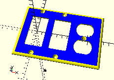
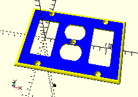
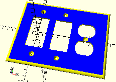

# WallPlate

**OpenSCAD Library for drawing Electrical Wall Plates**

Electrical wall plates are easy to buy so long as the devices you are trying to cover are a modern standard or not in some strange order in a muli-gang box.  [Decora](#Decora)-style devices are usually the way to go, but what if the device is old or just unusual.

This library can generate wall plates of standard sizes with any number of devices (gangs).  It can also create plates of arbitrary size and attributes to be the base of a custom design.

## Installation

Cloning the repository on to a local disk is enough to use the library.  If new wall plate files are kept in the top directory of the worktree then OpenSCAD should be able to find all the pieces.  Otherwise, the folder [`WallPlate`](./WallPlate) can be copied to any place in the [`OPENSCADPATH`](https://en.wikibooks.org/wiki/OpenSCAD_User_Manual/Libraries#Setting_OPENSCADPATH).

## Usage

### Getting Started

The only library required to make something happen is the Generator.

        /* Base Generator library */
        use <WallPlate/WallPlate_Generator.scad>;

This will also include the `WallPlate/WallPlate_Dimensions.scad` library which contains, not surprisingly, the standard dimensions for the various sized plates along with bunches of constants and functions for handling them and the `$dimensions` vector.

To add the modules that generate the particular devices, their libraries need to be included by name.

        /* Device specific libraries */
        use <WallPlate/WallPlate_Decora.scad>;
        use <WallPlate/WallPlate_ToggleSwitch.scad>;

Just to be lazy, everything needed to make a wall plate, including the Generator, can be brought in with one `include`.

        /* Just include all the Devices */
        include <WallPlate/WallPlate_IncludeAll.scad>;

### Making a simple plate

To make a plate using the included dimensions and devices, `include` the required libraries and use the `WallPlate()` module.

        use <WallPlate/WallPlate_Generator.scad>;
        use <WallPlate/WallPlate_Decora.scad>;
        use <WallPlate/WallPlate_Duplex.scad>;
        
        WallPlate(){
            Decora();
            Decora();
            Duplex();
        }

To change the order of the devices on the plate, just change their order in the list.

        WallPlate(){
            Decora();
            Duplex();
            Decora();
        }

### Changing the plate size

The `WallPlate()` module takes only one parameter, `dimensions`, which is a defined vector of 6 values.  (See the `DimensionsVector()` module.)  There are four predefined sizes, each returned by a "getter function".

* DefaultStandardDimensions() 
* DefaultMidwayDimensions()  
* DefaultOversizeDimensions() 
* DefaultJumboDimensions()  

"Standard" dimensions is the default.  To use any of the others, they can be passed to `WallPlate()`.

        WallPlate(DefaultOversizeDimensions()){
            Decora();
            Decora();
            Duplex();
        }

Most of the other modules in this library need to have `dimensions` defined either by passing it as a parameter, or more often because the global variable `$dimensions` is set to a dimensions vector.  It is through `$dimensions` that `WallPlate()` passes dimensions to the child modules drawing the devices.  The following expressions will produce the same output as above.

        $dimensions = DefaultOversizeDimensions();
        WallPlate(){
            Decora();
            Decora();
            Duplex();
        }

### Other examples

This repository includes the file `WallPlate_Examples.scad` which has several examples of using different modules.  Comment and un-comment out the sections or cut-n-paste them onto the OpenSCAD editor. 

## Libraries and their modules

Default values

### `WallPlate_Generator.scad`

* **Utility functions**

	* `mm( inch =` *float* `)`

		OpenSCAD is unitless, but 3D printing slicers (to my experience) considers a single unit to be a millimeters.  In general, length measurements passed to functions and modules are millimeters.  On the other hand, electrical plates, boxes, devices, etc. were defined in the bygone era of English measurement, so this function just does the conversion.
	
	* `top( depth =` *float*`, thickness =` *float* `)`

		Amount to raise (lower) an object of known thickness to be flush with plate of know depth.

	* `ifundef( value, default )`

		Return a default if undef. (Oft repeated pattern.)

	* `platewidth( gang =` *int*`, margin =` *float*`, gangwidth =` *float*`, dimensions =` *DimVector* `)`

		Calculate overall width of plate given gang count and plate type.

	* `mode( add =` *bool*`, subtract =` *bool* `)`

		Returns a string showing the Add/Subtract mode.  For logging.

* **Modules**

	* `WallPlate( dimensions =` *DimVector* `)`

		Generate a Wall Plate with the Devices listed as children.  The `dimensions` vector needs to be in the prescribed form but can be defined and passed to the module which will pass it on to the Device modules for their use.

		Usage:
		
				WallPlate(){
					Decora();
					Duplex();
					Duplex();
				}

	* `BlankPlate(` *params* `)`

		Generate a rounded, hollowed plate shape of arbitrary size

			gang          (pos int)       - Set horizontal size based on number of gang boxes
			width         (pos float)     - Horizontal size of plate
			height        (pos float)     - Vertical size of plate
			depth         (pos float)     - Overall distance from front face to wall
			thickness     (pos float)     - Distance between the outer face and inner hollow,
			                                0 to not create a hollow
			rounding      (pos float)     - Factor controlling the radius of the cylindrical
			                                arch based on depth
			skew          (pos float)     - Makes the cylinder more eccentric to shape 
			                                the rounding, 1 is a circular cross section
			dimensions    (vect[x])       - Vector describing the plate dimensions to use, 
			                                [height, margin, depth, etc.]
			colors        (vect[2] color) - Two color values to help distinguish surfaces 
			                                in preview
			add/subtract  (bool)          - Add/Subtract mode flags for debugging

		Supplying width, height, depth, etc. overrides the values derived from dimensions/gang.

	* `PlateRounder(` *params* `)`

		Place an EdgeRounder on all four edges of a plate.
		
			width         (pos float)     - Horizontal size of plate
			height        (pos float)     - Vertical size of plate
			depth         (pos float)     - Overall distance from front face to wall
			thickness     (pos float)     - Distance between the outer face and inner hollow,
			                                0 to not create a hollow
			rounding      (pos float)     - Factor controlling the radius of the cylindrical
			                                arch based on depth
			skew          (pos float)     - Makes the cylinder more eccentric to shape 
			                                the rounding, 1 is a circular cross section
			dimensions    (vect[x])       - Vector describing the plate dimensions to use, 
			                                [height, margin, depth, etc.]

	* `EdgeRounder(` *params* `)`

		Generate a shape that can be subtracted from the plate body to create a rounded edge bevel.

			length          (pos float)   - The length of the edge to round. Required
			roundingradius  (pos float)   - Radius of the cylindrical arch
			skew            (pos float)   - Makes the cylinder more eccentric to shape the 
			                                rounding, 1 is a circular cross section,
			dimensions      (vect[x])     - Vector describing the plate dimensions to use, 
			                                [height, margin, depth, etc.]

	* `ReRound( dimensions =` *DimVector* `)`

		Re-round the top and bottom edge of the plate if something has extended beyond it.
	
		Preface the device for the gang needing the rounding.

			ReRound() Decora();

## Known Bugs

* Even

## Version

<!-- $Id$ -->

$Revision$ $Tags$

## Copyright

&copy; 2020 Bion Pohl/Omega Pudding Software Some Rights Reserved

$Author$ $Email$
